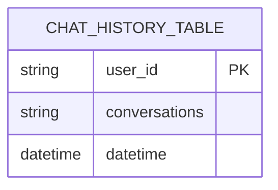
```mermaid

erDiagram
    CHAT_HISTORY_TABLE {
        string user_id "PK"
        string conversations
        datetime datetime
    }

```

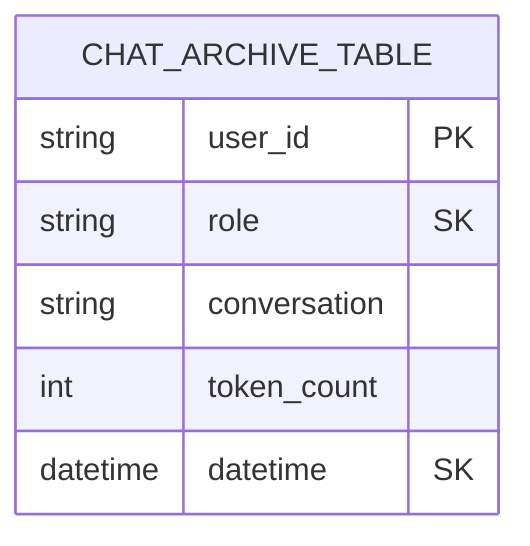
```mermaid
erDiagram
    CHAT_ARCHIVE_TABLE {
        string user_id "PK"
        string role "SK"
        string conversation 
        int token_count 
        datetime datetime "SK"
    }

```
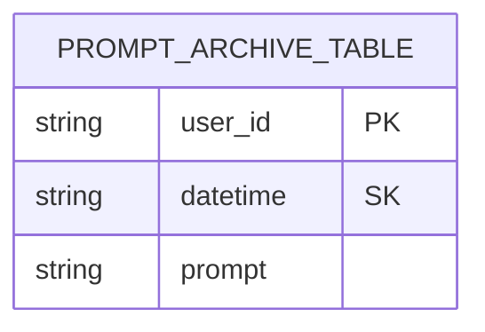
```mermaid
erDiagram
    PROMPT_ARCHIVE_TABLE {
        string user_id "PK"
        string datetime "SK"
        string prompt
    }

```
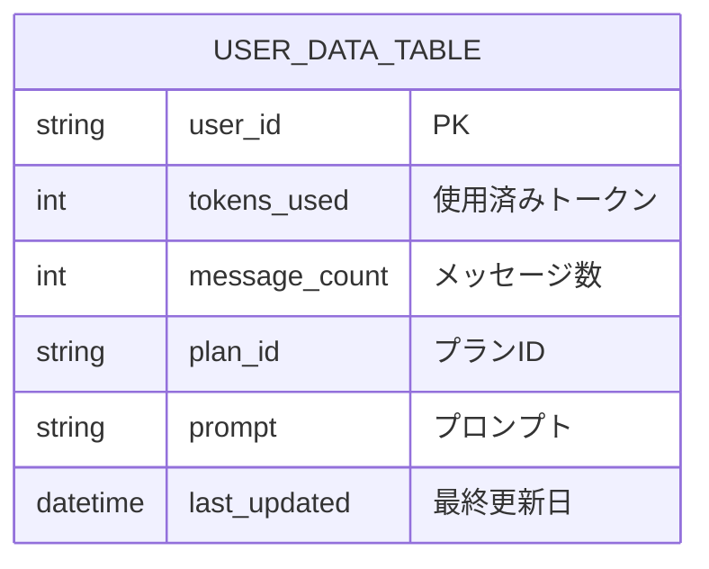
```mermaid
erDiagram
    USER_DATA_TABLE {
        string user_id "PK"
        int tokens_used "使用済みトークン"
        int message_count "メッセージ数"
        string plan_id "プランID"
        string prompt "プロンプト"
        datetime last_updated "最終更新日"
    }

```

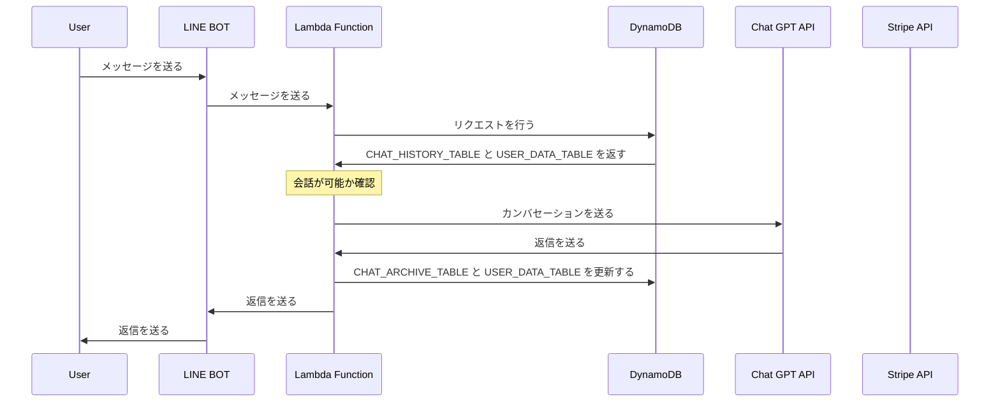
```mermaid
sequenceDiagram
    participant User as User
    participant LineBot as LINE BOT
    participant Lambda as Lambda Function
    participant DynamoDB as DynamoDB
    participant ChatGPT as Chat GPT API
    participant Stripe as Stripe API

    User->>LineBot: メッセージを送る
    LineBot->>Lambda: メッセージを送る
    Lambda->>DynamoDB: リクエストを行う
    DynamoDB->>Lambda: CHAT_HISTORY_TABLE と USER_DATA_TABLE を返す
    Note over Lambda: 会話が可能か確認
    Lambda->>ChatGPT: カンバセーションを送る
    ChatGPT->>Lambda: 返信を送る

    Lambda->>DynamoDB: CHAT_ARCHIVE_TABLE と USER_DATA_TABLE を更新する
    Lambda->>LineBot: 返信を送る
    LineBot->>User: 返信を送る


```

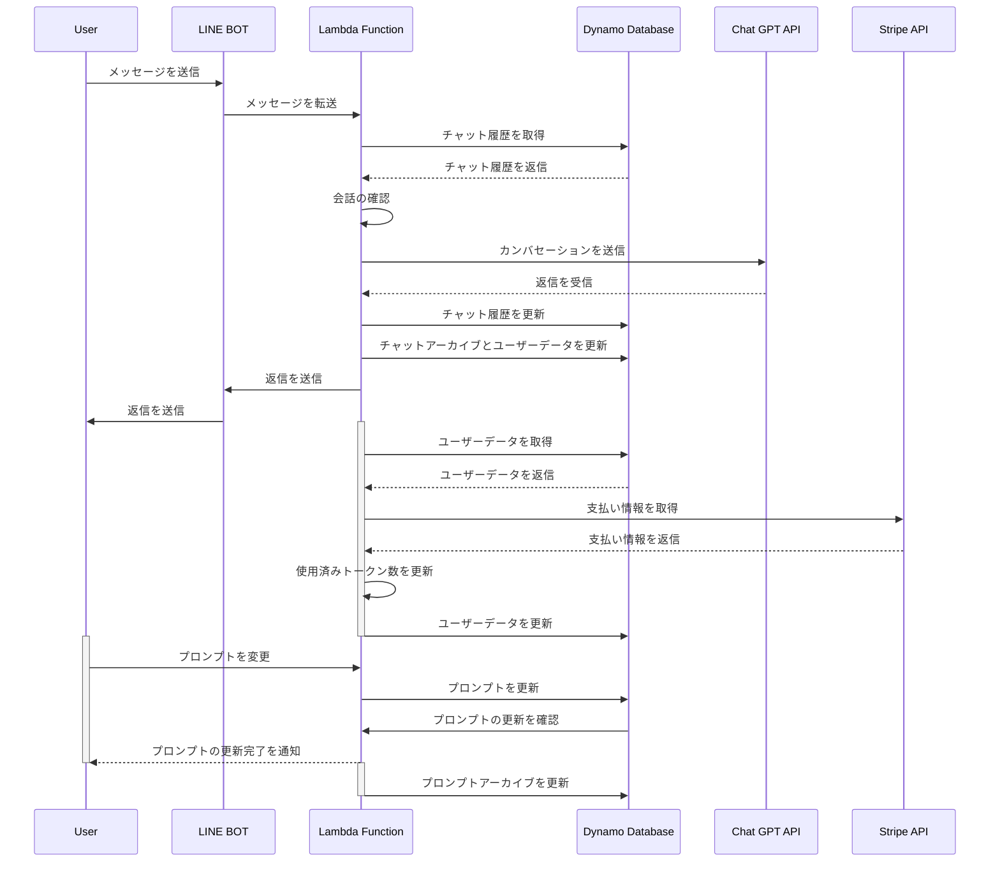
```mermaid
sequenceDiagram
  participant User
  participant LINE BOT
  participant Lambda Function
  participant Dynamo Database
  participant Chat GPT API
  participant Stripe API

  User->>LINE BOT: メッセージを送信
  LINE BOT->>Lambda Function: メッセージを転送
  Lambda Function->>Dynamo Database: チャット履歴を取得
  Dynamo Database-->>Lambda Function: チャット履歴を返信
  Lambda Function->>Lambda Function: 会話の確認
  Lambda Function->>Chat GPT API: カンバセーションを送信
  Chat GPT API-->>Lambda Function: 返信を受信
  Lambda Function->>Dynamo Database: チャット履歴を更新
  Lambda Function->>Dynamo Database: チャットアーカイブとユーザーデータを更新
  Lambda Function->>LINE BOT: 返信を送信
  LINE BOT->>User: 返信を送信

  activate Lambda Function
  Lambda Function->>Dynamo Database: ユーザーデータを取得
  Dynamo Database-->>Lambda Function: ユーザーデータを返信
  Lambda Function->>Stripe API: 支払い情報を取得
  Stripe API-->>Lambda Function: 支払い情報を返信
  Lambda Function->>Lambda Function: 使用済みトークン数を更新
  Lambda Function->>Dynamo Database: ユーザーデータを更新
  deactivate Lambda Function
  
  activate User
  User->>Lambda Function: プロンプトを変更
  Lambda Function->>Dynamo Database: プロンプトを更新
  Dynamo Database->>Lambda Function: プロンプトの更新を確認
  Lambda Function-->>User: プロンプトの更新完了を通知
  deactivate User
  
  activate Lambda Function
  Lambda Function->>Dynamo Database: プロンプトアーカイブを更新
  deactivate Lambda Function


```
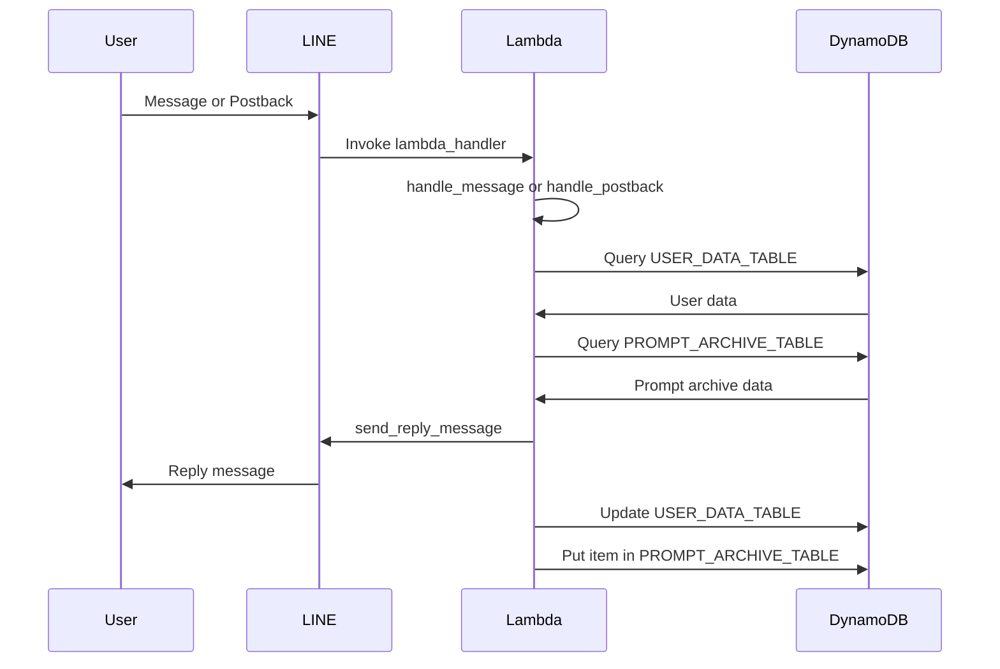
```mermaid
sequenceDiagram
    participant User
    participant LINE
    participant Lambda
    participant DynamoDB

    User->>LINE: Message or Postback
    LINE->>Lambda: Invoke lambda_handler
    Lambda->>Lambda: handle_message or handle_postback
    Lambda->>DynamoDB: Query USER_DATA_TABLE
    DynamoDB->>Lambda: User data
    Lambda->>DynamoDB: Query PROMPT_ARCHIVE_TABLE
    DynamoDB->>Lambda: Prompt archive data
    Lambda->>LINE: send_reply_message
    LINE->>User: Reply message
    Lambda->>DynamoDB: Update USER_DATA_TABLE
    Lambda->>DynamoDB: Put item in PROMPT_ARCHIVE_TABLE

```

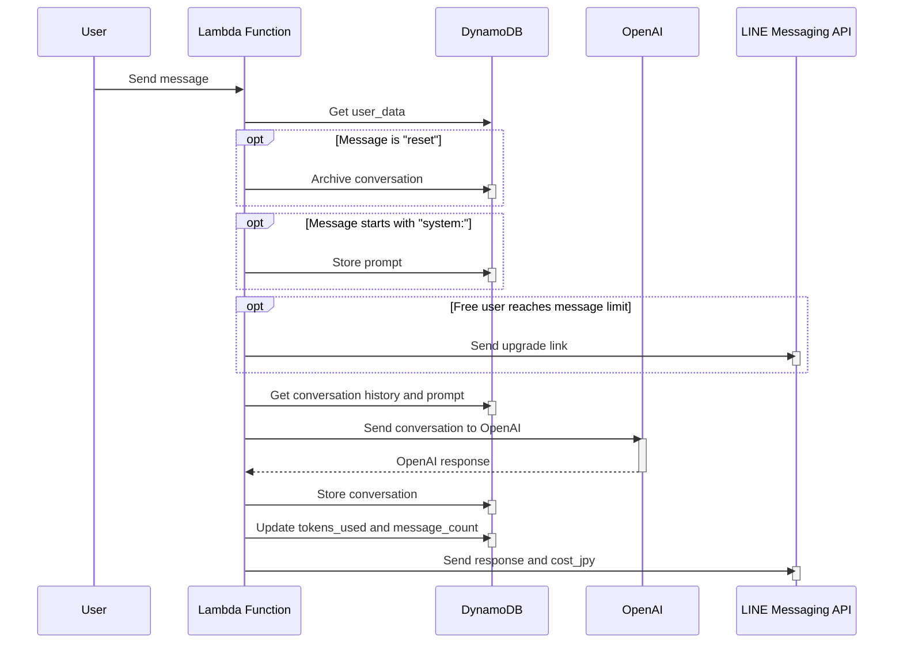
```mermaid
sequenceDiagram
    participant user as User
    participant lambda as Lambda Function
    participant dynamo as DynamoDB
    participant openai as OpenAI
    participant line as LINE Messaging API
    user->>lambda: Send message
    lambda->>dynamo: Get user_data
    opt Message is "reset"
        lambda->>dynamo: Archive conversation
        activate dynamo
        deactivate dynamo
    end
    opt Message starts with "system:"
        lambda->>dynamo: Store prompt
        activate dynamo
        deactivate dynamo
    end
    opt Free user reaches message limit
        lambda->>line: Send upgrade link
        activate line
        deactivate line
    end
    lambda->>dynamo: Get conversation history and prompt
    activate dynamo
    deactivate dynamo
    lambda->>openai: Send conversation to OpenAI
    activate openai
    openai-->>lambda: OpenAI response
    deactivate openai
    lambda->>dynamo: Store conversation
    activate dynamo
    deactivate dynamo
    lambda->>dynamo: Update tokens_used and message_count
    activate dynamo
    deactivate dynamo
    lambda->>line: Send response and cost_jpy
    activate line
    deactivate line

```

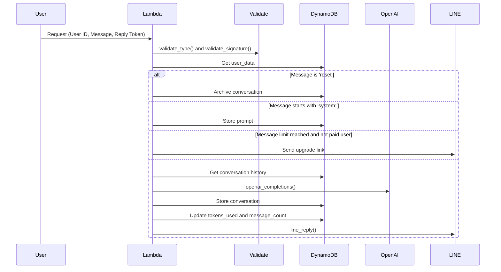
```mermaid
sequenceDiagram
    participant User
    participant Lambda
    participant Validate
    participant DynamoDB
    participant OpenAI
    participant LINE
    User->>Lambda: Request (User ID, Message, Reply Token)
    Lambda->>Validate: validate_type() and validate_signature()
    Lambda->>DynamoDB: Get user_data
    alt Message is 'reset'
        Lambda->>DynamoDB: Archive conversation
    else Message starts with 'system:'
        Lambda->>DynamoDB: Store prompt
    else Message limit reached and not paid user
        Lambda->>LINE: Send upgrade link
    else
        Lambda->>DynamoDB: Get conversation history
        Lambda->>OpenAI: openai_completions()
        Lambda->>DynamoDB: Store conversation
        Lambda->>DynamoDB: Update tokens_used and message_count
        Lambda->>LINE: line_reply()
    end


```

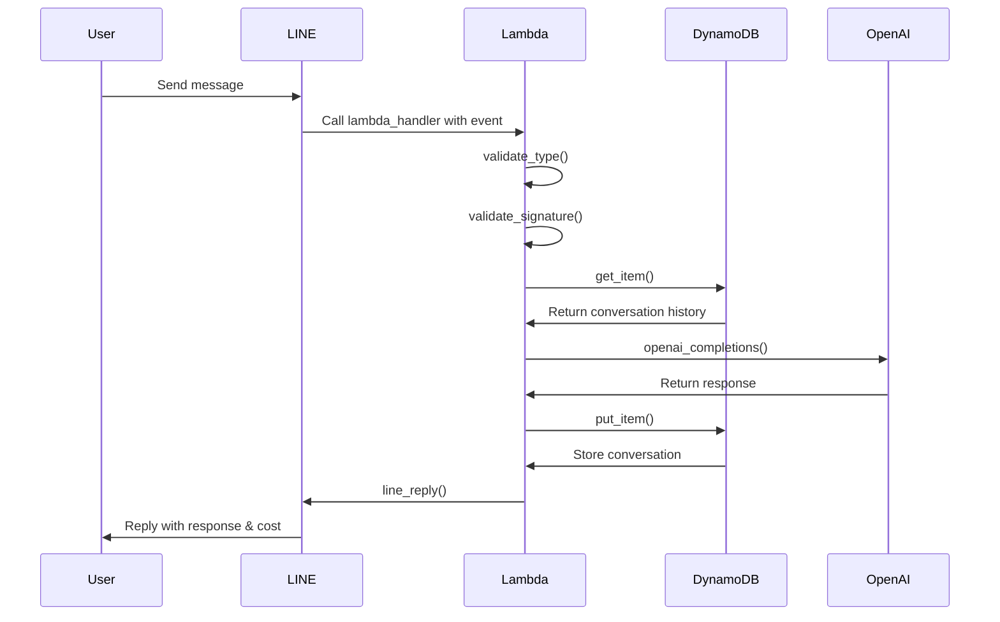
```mermaid

sequenceDiagram
    participant User
    participant LINE
    participant Lambda
    participant DynamoDB
    participant OpenAI
    User->>LINE: Send message
    LINE->>Lambda: Call lambda_handler with event
    Lambda->>Lambda: validate_type()
    Lambda->>Lambda: validate_signature()
    Lambda->>DynamoDB: get_item()
    DynamoDB->>Lambda: Return conversation history
    Lambda->>OpenAI: openai_completions()
    OpenAI->>Lambda: Return response
    Lambda->>DynamoDB: put_item()
    DynamoDB->>Lambda: Store conversation
    Lambda->>LINE: line_reply()
    LINE->>User: Reply with response & cost


```

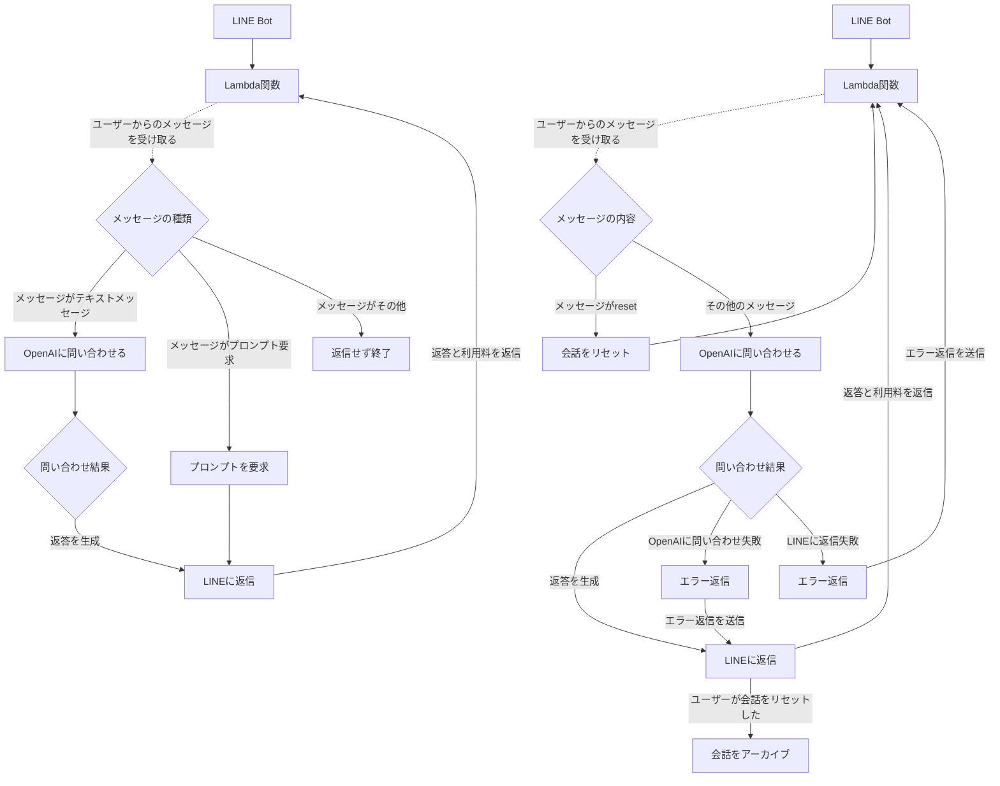
```mermaid

graph TD;
    A[LINE Bot]-->B[Lambda関数];
    B-.ユーザーからのメッセージを受け取る.->C{メッセージの種類};
    C-- メッセージがテキストメッセージ -->D[OpenAIに問い合わせる];
    D-->E{問い合わせ結果};
    E-- 返答を生成 -->F[LINEに返信];
    C-- メッセージがプロンプト要求 -->G[プロンプトを要求];
    C-- メッセージがその他 -->H[返信せず終了];
    G-->F;
    F-- 返答と利用料を返信 -->B;
    
    I[LINE Bot]-->J[Lambda関数];
    J-.ユーザーからのメッセージを受け取る.->K{メッセージの内容};
    K-- メッセージがreset -->L[会話をリセット];
    L-->J;
    K-- その他のメッセージ -->M[OpenAIに問い合わせる];
    M-->N{問い合わせ結果};
    N-- 返答を生成 -->O[LINEに返信];
    O-- 返答と利用料を返信 -->J;
    N-- OpenAIに問い合わせ失敗 -->P[エラー返信];
    P-- エラー返信を送信 -->O;
    N-- LINEに返信失敗 -->Q[エラー返信];
    Q-- エラー返信を送信 -->J;
    O-- ユーザーが会話をリセットした -->R[会話をアーカイブ];


```

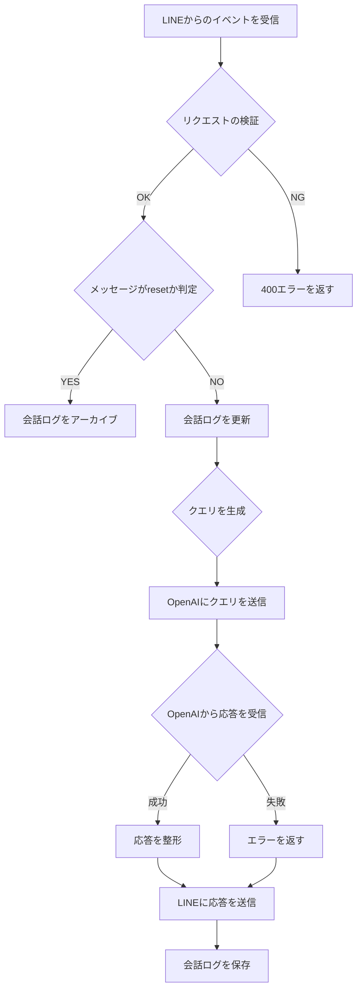
```mermaid

graph TD;
    A[LINEからのイベントを受信] --> B{リクエストの検証}
    B -->|OK| C{メッセージがresetか判定}
    B -->|NG| D[400エラーを返す]
    C -->|YES| E[会話ログをアーカイブ]
    C -->|NO| F[会話ログを更新]
    F --> G{クエリを生成}
    G --> H[OpenAIにクエリを送信]
    H --> I{OpenAIから応答を受信}
    I -->|成功| J[応答を整形]
    I -->|失敗| K[エラーを返す]
    J --> L[LINEに応答を送信]
    L --> M[会話ログを保存]
    K --> L


```

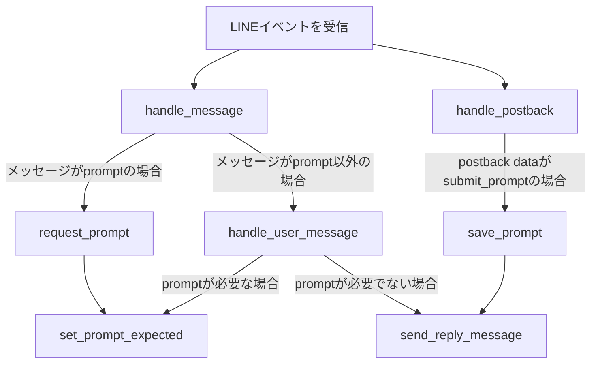
```mermaid
graph TD;
    receive_event[LINEイベントを受信]-->handle_message;
    receive_event-->handle_postback;
    handle_message-->|メッセージがpromptの場合|request_prompt;
    handle_message-->|メッセージがprompt以外の場合|handle_user_message;
    handle_user_message-->|promptが必要な場合|set_prompt_expected;
    handle_user_message-->|promptが必要でない場合|send_reply_message;
    request_prompt-->set_prompt_expected;
    handle_postback-->|postback dataがsubmit_promptの場合|save_prompt;
    save_prompt-->send_reply_message;


```

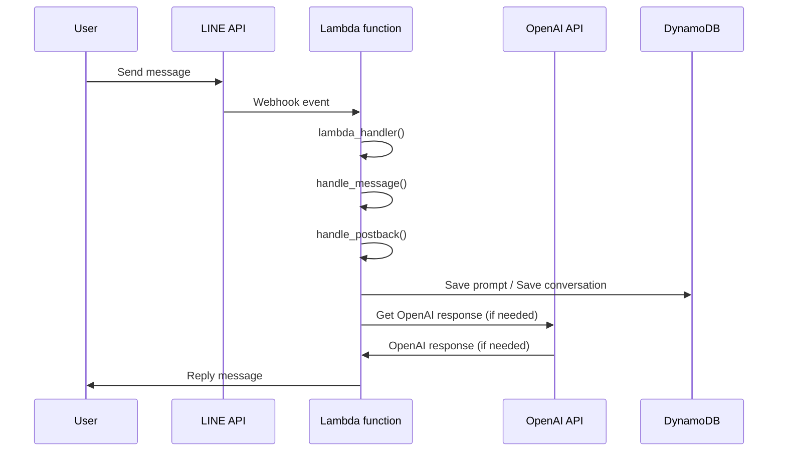
```mermaid

sequenceDiagram
    participant U as User
    participant L as LINE API
    participant La as Lambda function
    participant O as OpenAI API
    participant D as DynamoDB
    U->>L: Send message
    L->>La: Webhook event
    La->>La: lambda_handler()
    La->>La: handle_message()
    La->>La: handle_postback()
    La->>D: Save prompt / Save conversation
    La->>O: Get OpenAI response (if needed)
    O->>La: OpenAI response (if needed)
    La->>U: Reply message


```

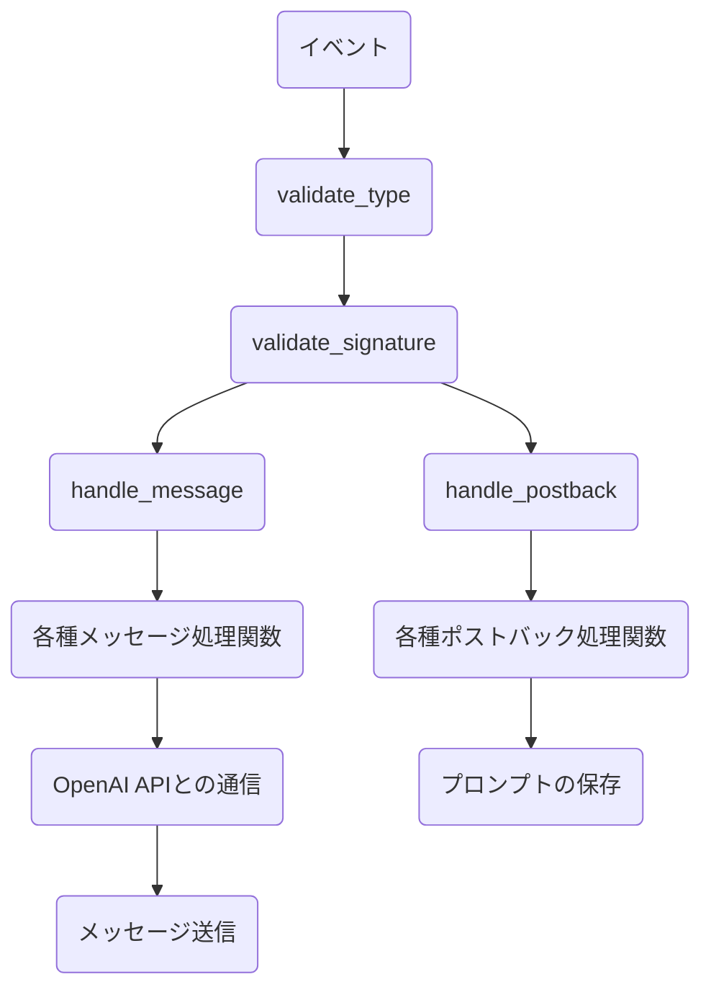
```mermaid
graph TD
A(イベント) --> B(validate_type)
B --> C(validate_signature)
C --> D(handle_message)
C --> E(handle_postback)
D --> F(各種メッセージ処理関数)
E --> G(各種ポストバック処理関数)
F --> H(OpenAI APIとの通信)
H --> I(メッセージ送信)
G --> J(プロンプトの保存)


```

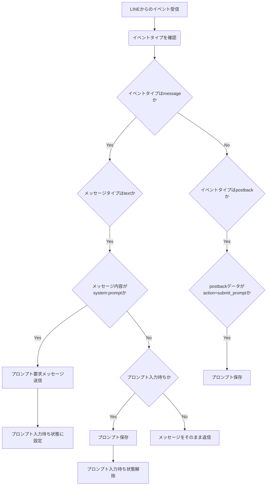
```mermaid
graph TB
  A[LINEからのイベント受信] --> B(イベントタイプを確認)
  B --> C{イベントタイプはmessageか}
  C -->|Yes| D{メッセージタイプはtextか}
  D -->|Yes| E{メッセージ内容がsystem:promptか}
  E -->|Yes| F[プロンプト要求メッセージ送信]
  F --> G[プロンプト入力待ち状態に設定]
  E -->|No| H{プロンプト入力待ちか}
  H -->|Yes| I[プロンプト保存]
  I --> J[プロンプト入力待ち状態解除]
  H -->|No| K[メッセージをそのまま返信]
  C -->|No| L{イベントタイプはpostbackか}
  L -->|Yes| M{postbackデータがaction=submit_promptか}
  M -->|Yes| N[プロンプト保存]


```

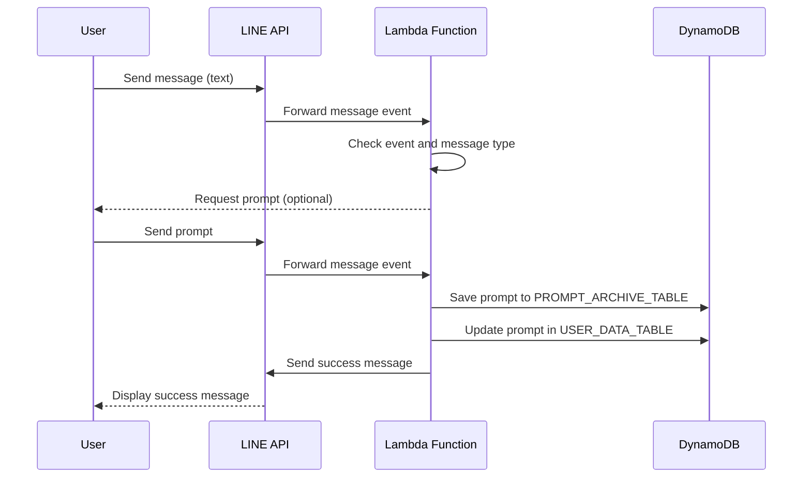
```mermaid

sequenceDiagram
  participant User as User
  participant Line as LINE API
  participant Lambda as Lambda Function
  participant Dynamo as DynamoDB

  User->>Line: Send message (text)
  Line->>Lambda: Forward message event
  Lambda->>Lambda: Check event and message type
  Lambda-->>User: Request prompt (optional)
  User->>Line: Send prompt
  Line->>Lambda: Forward message event
  Lambda->>Dynamo: Save prompt to PROMPT_ARCHIVE_TABLE
  Lambda->>Dynamo: Update prompt in USER_DATA_TABLE
  Lambda->>Line: Send success message
  Line-->>User: Display success message


```

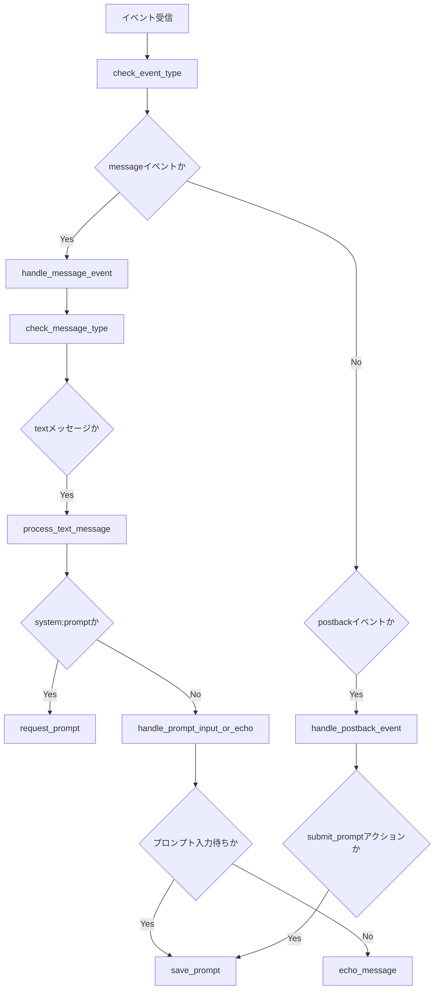
```mermaid

graph TB
  A[イベント受信] --> B[check_event_type]
  B --> C{messageイベントか}
  C -->|Yes| D[handle_message_event]
  D --> E[check_message_type]
  E --> F{textメッセージか}
  F -->|Yes| G[process_text_message]
  G --> H{system:promptか}
  H -->|Yes| I[request_prompt]
  H -->|No| J[handle_prompt_input_or_echo]
  J --> K{プロンプト入力待ちか}
  K -->|Yes| L[save_prompt]
  K -->|No| M[echo_message]
  C -->|No| N{postbackイベントか}
  N -->|Yes| O[handle_postback_event]
  O --> P{submit_promptアクションか}
  P -->|Yes| L[save_prompt]

```

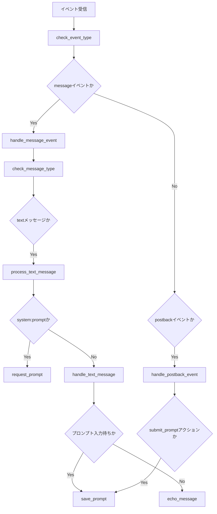
```mermaid

graph TB
  A[イベント受信] --> B[check_event_type]
  B --> C{messageイベントか}
  C -->|Yes| D[handle_message_event]
  D --> E[check_message_type]
  E --> F{textメッセージか}
  F -->|Yes| G[process_text_message]
  G --> H{system:promptか}
  H -->|Yes| I[request_prompt]
  H -->|No| J[handle_text_message]
  J --> K{プロンプト入力待ちか}
  K -->|Yes| L[save_prompt]
  K -->|No| M[echo_message]
  C -->|No| N{postbackイベントか}
  N -->|Yes| O[handle_postback_event]
  O --> P{submit_promptアクションか}
  P -->|Yes| L[save_prompt]


```

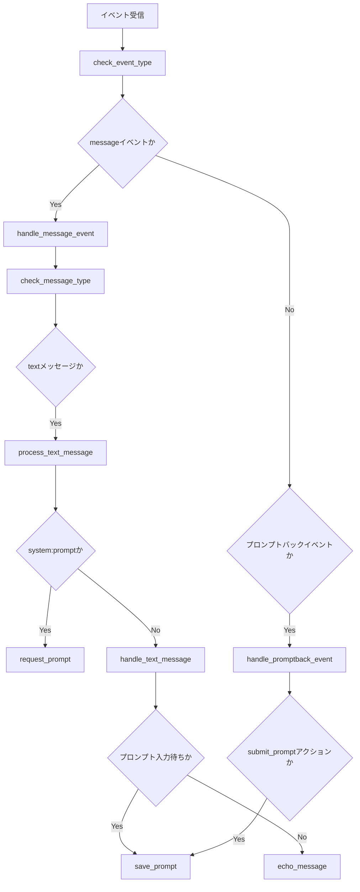
```mermaid

graph TB
  A[イベント受信] --> B[check_event_type]
  B --> C{messageイベントか}
  C -->|Yes| D[handle_message_event]
  D --> E[check_message_type]
  E --> F{textメッセージか}
  F -->|Yes| G[process_text_message]
  G --> H{system:promptか}
  H -->|Yes| I[request_prompt]
  H -->|No| J[handle_text_message]
  J --> K{プロンプト入力待ちか}
  K -->|Yes| L[save_prompt]
  K -->|No| M[echo_message]
  C -->|No| N{プロンプトバックイベントか}
  N -->|Yes| O[handle_promptback_event]
  O --> P{submit_promptアクションか}
  P -->|Yes| L[save_prompt]


```

```mermaid

sequenceDiagram
User->>+LINE Bot: message
Note right of LINE Bot: Validate message
LINE Bot->>+DynamoDB: Get user data
Note right of DynamoDB: Retrieve prompt_expected, prompt and message_count
DynamoDB-->>-LINE Bot: User data
alt message == "system:prompt"
    LINE Bot->>+User: Request new prompt
    LINE Bot->>DynamoDB: Set prompt_expected to True
else message matches "system:.*"
    Note over LINE Bot: Future handling of other system keywords
else prompt_expected == True
    LINE Bot->>DynamoDB: Save new prompt
    LINE Bot->>DynamoDB: Set prompt_expected to False
    LINE Bot->>+User: Prompt saved
else
    LINE Bot->>OpenAI: Send message with current prompt
    OpenAI->>LINE Bot: AI response
    LINE Bot->>+User: AI response
    LINE Bot->>DynamoDB: Update message_count
end


```

```mermaid

sequenceDiagram
    participant U as User
    participant LINE as LINE API
    participant L as Lambda
    participant DT as DynamoDB
    participant G as GPT
    participant O as OpenAI API

    U->>L: Send Message
    L->>L: handle_message()
    alt Prompt Expected
        L->>DT: set_prompt_expected()
        L->>DT: save_and_archive_prompt()
        L->>DT: get_user_prompt()
        L->>G: generate_gpt_response()
        G->>O: Request OpenAI API
        O->>G: OpenAI API Response
        L->>LINE: send_reply_message()
        LINE->>U: Reply Message
    else Normal Message Processing
        L->>DT: get_prompt_expected()
        L->>L: process_and_reply()
        L->>DT: get_user_prompt()
        L->>G: generate_gpt_response()
        G->>O: Request OpenAI API
        O->>G: OpenAI API Response
        L->>LINE: send_reply_message()
        LINE->>U: Reply Message
    end


```

```mermaid

sequenceDiagram
    participant User as ユーザー
    participant UI as ユーザーインターフェイス
    participant API as APIサーバー
    participant NLP as NLPエンジン
    participant RG as 応答生成エンジン
    participant DB as データベース

    User->>UI: メッセージ入力
    UI->>API: メッセージ送信
    API->>NLP: テキスト解析
    NLP->>API: 解析結果
    API->>RG: 応答生成
    RG->>API: 生成された応答
    API->>DB: 対話履歴保存
    DB->>API: 保存完了
    API->>UI: 応答送信
    UI->>User: 応答表示


```

```mermaid

graph LR
    A[ユーザーインターフェイス] --> B[APIサーバー]
    B --> C[ChatGPT]
    B --> D[エピソード記憶処理]
    B --> E[文脈圧縮処理]
    B --> F[分散表現処理]
    B --> G[知識グラフ処理]
    G --> H[データベース]
    H --> G
    D --> B
    E --> B
    F --> B
    C --> B
    B --> A


```

```mermaid
graph TD
    A[lambda_handler] --> B[handle_reset_conversation]
    A --> C[handle_prompt_input]
    A --> D[handle_prompt_save]
    A --> E[handle_response]
    B --> F[send_reply_message]
    C --> F
    D --> G[save_prompt]
    D --> H[set_prompt_expected]
    E --> I[populate_conversation]
    E --> J[openai_completions]
    E --> K[format_openai_response]
    E --> L[get_openai_cost_jpy]
    E --> M[store_conversation]
    E --> F
    G --> F
    H --> N[USER_DATA_TABLE.update_item]
    I --> O[CHAT_ARCHIVE_TABLE.query]
    J --> P[requests.post]
    M --> Q[CHAT_ARCHIVE_TABLE.put_item]


```

```mermaid

sequenceDiagram
    participant lambda_handler as L
    participant handle_reset_conversation as R
    participant handle_prompt_input as PI
    participant handle_prompt_save as PS
    participant handle_response as HR
    participant send_reply_message as SRM
    participant save_prompt as SP
    participant set_prompt_expected as SPE
    participant USER_DATA_TABLE.update_item as UDT
    participant populate_conversation as PC
    participant openai_completions as OC
    participant format_openai_response as FOR
    participant get_openai_cost_jpy as GOC
    participant store_conversation as SC
    participant CHAT_ARCHIVE_TABLE.query as CATQ
    participant requests.post as RP
    participant CHAT_ARCHIVE_TABLE.put_item as CATP

    L->>R: handle_reset_conversation
    R->>SRM: send_reply_message
    L->>PI: handle_prompt_input
    PI->>SRM: send_reply_message
    L->>PS: handle_prompt_save
    PS->>SP: save_prompt
    SP->>SRM: send_reply_message
    PS->>SPE: set_prompt_expected
    SPE->>UDT: USER_DATA_TABLE.update_item
    L->>HR: handle_response
    HR->>PC: populate_conversation
    PC->>CATQ: CHAT_ARCHIVE_TABLE.query
    HR->>OC: openai_completions
    OC->>RP: requests.post
    HR->>FOR: format_openai_response
    HR->>GOC: get_openai_cost_jpy
    HR->>SC: store_conversation
    SC->>CATP: CHAT_ARCHIVE_TABLE.put_item
    HR->>SRM: send_reply_message


```

```mermaid

graph TD
    A["lambda_handler"] --> B["handle_reset_conversation"]
    A --> C["handle_prompt_input"]
    A --> D["handle_prompt_save"]
    A --> E["handle_response"]

    B --> F["CHAT_HISTORY_TABLE.update_item"]
    B --> G["send_reply_message"]

    C --> H["request_prompt"]
    C --> I["set_prompt_expected"]

    D --> J["save_prompt"]
    D --> K["set_prompt_expected"]

    E --> L["populate_conversation"]
    E --> M["openai_completions"]
    E --> N["format_openai_response"]
    E --> O["get_openai_cost_jpy"]
    E --> P["store_conversation"]
    E --> Q["send_reply_message"]

    J --> R["PROMPT_ARCHIVE_TABLE.put_item"]
    J --> S["USER_DATA_TABLE.update_item"]

    L --> T["CHAT_ARCHIVE_TABLE.query"]

    M --> U["requests.post"]

    P --> V["CHAT_ARCHIVE_TABLE.put_item"]


```

```mermaid

graph TD
    A["lambda_handler"] --> B["handle_reset_conversation"]
    A --> C["handle_prompt_input"]
    A --> D["handle_prompt_save"]
    A --> E["handle_response"]

    B --> F["CHAT_HISTORY_TABLE.update_item"]
    B --> G["send_reply_message"]
    G --> Z["End"]

    C --> H["request_prompt"]
    H --> Z
    C --> I["set_prompt_expected"]
    I --> Z

    D --> J["save_prompt"]
    J --> K["set_prompt_expected"]
    K --> Z

    E --> L["populate_conversation"]
    E --> M["openai_completions"]
    E --> N["format_openai_response"]
    E --> O["get_openai_cost_jpy"]
    E --> P["store_conversation"]
    E --> Q["send_reply_message"]
    Q --> Z

    J --> R["PROMPT_ARCHIVE_TABLE.put_item"]
    R --> Z
    J --> S["USER_DATA_TABLE.update_item"]
    S --> Z

    L --> T["CHAT_ARCHIVE_TABLE.query"]
    T --> Z

    M --> U["requests.post"]
    U --> Z

    P --> V["CHAT_ARCHIVE_TABLE.put_item"]
    V --> Z
    Z["End"]


```

```mermaid


```
