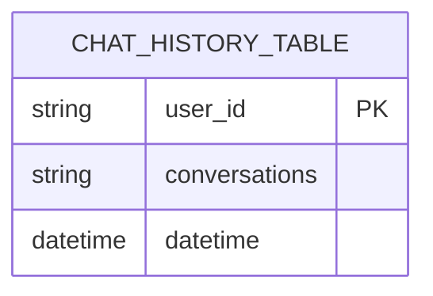
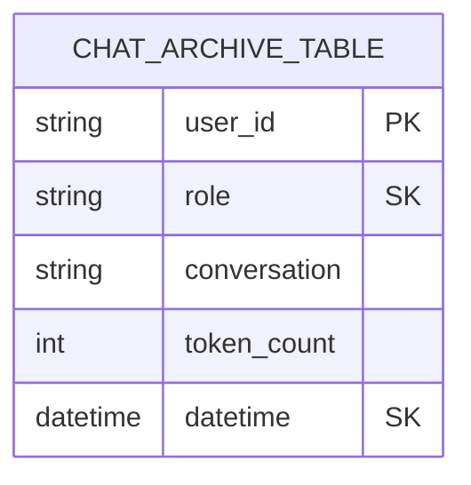
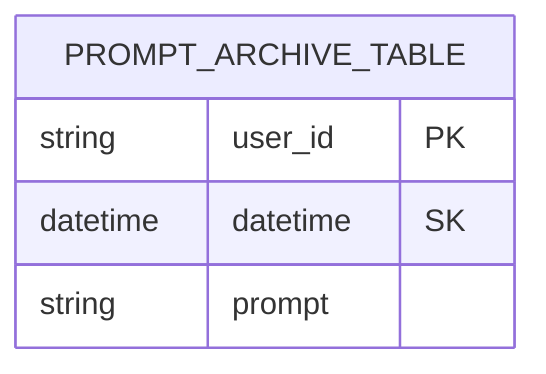
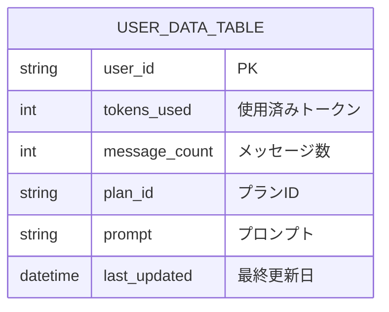
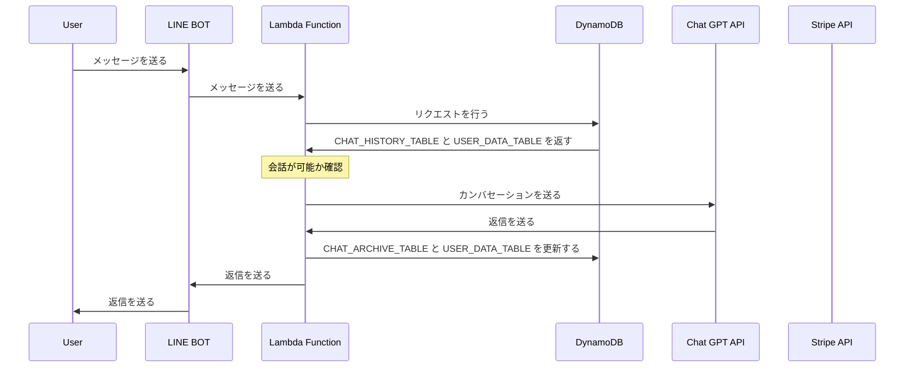
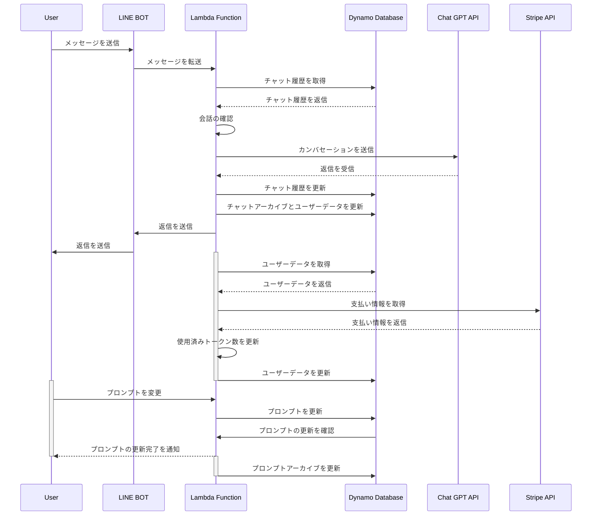

```mermaid

erDiagram
    CHAT_HISTORY_TABLE {
        string user_id "PK"
        string conversations
        datetime datetime
    }

```


```mermaid
erDiagram
    CHAT_ARCHIVE_TABLE {
        string user_id "PK"
        string role "SK"
        string conversation 
        int token_count 
        datetime datetime "SK"
    }

```

```mermaid
erDiagram
    PROMPT_ARCHIVE_TABLE {
        string user_id "PK"
        datetime datetime "SK"
        string prompt
    }

```

```mermaid
erDiagram
    USER_DATA_TABLE {
        string user_id "PK"
        int tokens_used "使用済みトークン"
        int message_count "メッセージ数"
        string plan_id "プランID"
        string prompt "プロンプト"
        datetime last_updated "最終更新日"
    }

```



```mermaid
sequenceDiagram
    participant User as User
    participant LineBot as LINE BOT
    participant Lambda as Lambda Function
    participant DynamoDB as DynamoDB
    participant ChatGPT as Chat GPT API
    participant Stripe as Stripe API

    User->>LineBot: メッセージを送る
    LineBot->>Lambda: メッセージを送る
    Lambda->>DynamoDB: リクエストを行う
    DynamoDB->>Lambda: CHAT_HISTORY_TABLE と USER_DATA_TABLE を返す
    Note over Lambda: 会話が可能か確認
    Lambda->>ChatGPT: カンバセーションを送る
    ChatGPT->>Lambda: 返信を送る

    Lambda->>DynamoDB: CHAT_ARCHIVE_TABLE と USER_DATA_TABLE を更新する
    Lambda->>LineBot: 返信を送る
    LineBot->>User: 返信を送る


```



```mermaid
sequenceDiagram
  participant User
  participant LINE BOT
  participant Lambda Function
  participant Dynamo Database
  participant Chat GPT API
  participant Stripe API

  User->>LINE BOT: メッセージを送信
  LINE BOT->>Lambda Function: メッセージを転送
  Lambda Function->>Dynamo Database: チャット履歴を取得
  Dynamo Database-->>Lambda Function: チャット履歴を返信
  Lambda Function->>Lambda Function: 会話の確認
  Lambda Function->>Chat GPT API: カンバセーションを送信
  Chat GPT API-->>Lambda Function: 返信を受信
  Lambda Function->>Dynamo Database: チャット履歴を更新
  Lambda Function->>Dynamo Database: チャットアーカイブとユーザーデータを更新
  Lambda Function->>LINE BOT: 返信を送信
  LINE BOT->>User: 返信を送信

  activate Lambda Function
  Lambda Function->>Dynamo Database: ユーザーデータを取得
  Dynamo Database-->>Lambda Function: ユーザーデータを返信
  Lambda Function->>Stripe API: 支払い情報を取得
  Stripe API-->>Lambda Function: 支払い情報を返信
  Lambda Function->>Lambda Function: 使用済みトークン数を更新
  Lambda Function->>Dynamo Database: ユーザーデータを更新
  deactivate Lambda Function
  
  activate User
  User->>Lambda Function: プロンプトを変更
  Lambda Function->>Dynamo Database: プロンプトを更新
  Dynamo Database->>Lambda Function: プロンプトの更新を確認
  Lambda Function-->>User: プロンプトの更新完了を通知
  deactivate User
  
  activate Lambda Function
  Lambda Function->>Dynamo Database: プロンプトアーカイブを更新
  deactivate Lambda Function


```
```mermaid

```